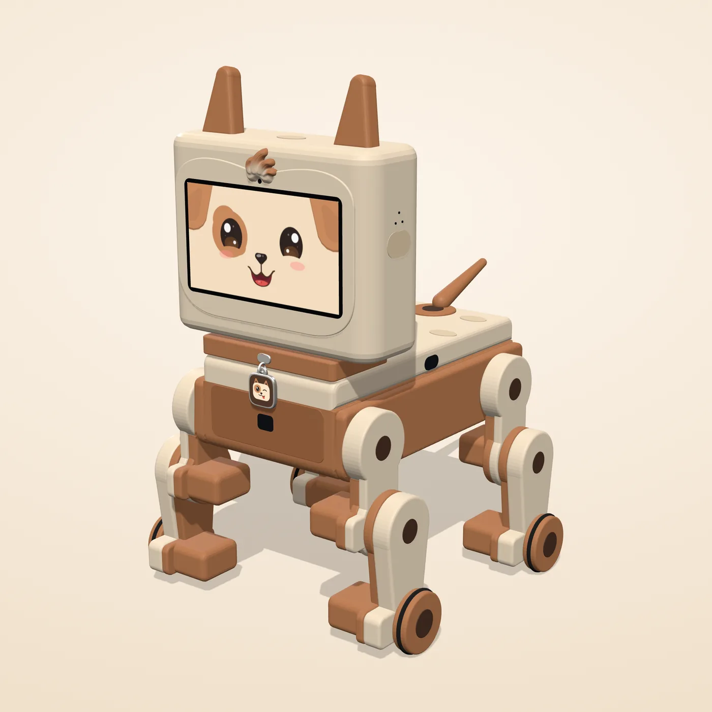
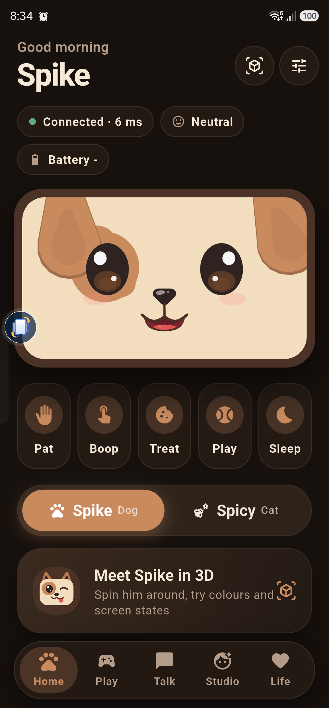
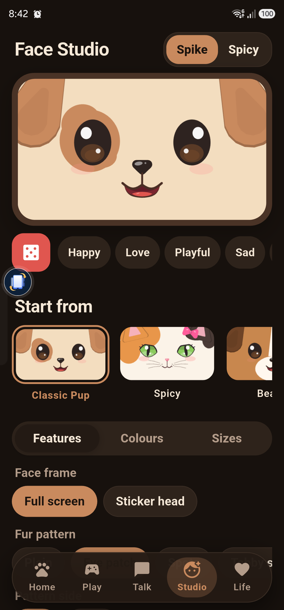
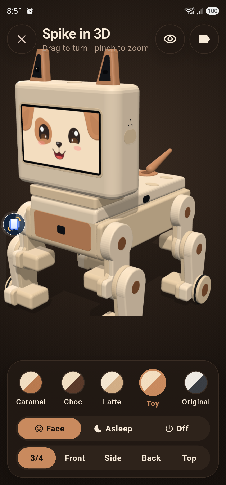
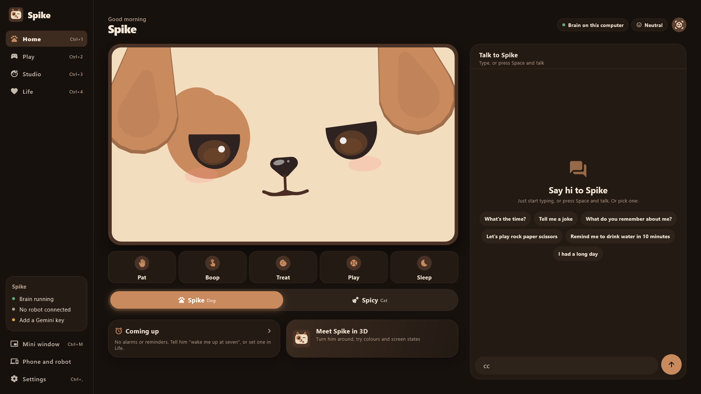

# Spike

**A desk robot dog with a face, a memory and a personality, and the apps that bring him to life.**

Spike (the hardware project is called *Desk Buddy*) is a small four-legged companion that lives on your
desk. His face is a 4.3-inch touch screen. He hears you, sees you, remembers what you tell him, wakes you
up, teases you when you're fine and goes gentle when you're not. When he's away from the robot body, the
same character lives on your phone and your Windows PC.

> **All rights reserved. This repository is source-available for viewing only.**
> No licence is granted to copy, modify, build, distribute or use any part of it. See [LICENSE](LICENSE).
> Third-party components keep their own licences: see [THIRD_PARTY_NOTICES.md](THIRD_PARTY_NOTICES.md).

  

## What's in here

| Part | Folder | What it is |
|---|---|---|
| **Face** | `software/face_v2/`, `software/face/` | The animated character face (Spike the pup, Spicy the cat): moods, expressions, games, captions and sounds, drawn procedurally. A browser build doubles as the reference the firmware is tested against. |
| **Brain** | `software/laptop/spike_brain/` | The mind that runs on your own computer: wake words, speech recognition, conversation, persona, long-term memory, alarms and reminders, vision events and a natural voice. Private by design: speech, vision and memory stay on the laptop. |
| **Firmware** | `software/firmware/` | ESP32-S3 firmware for the two boards: the screen board (face renderer, body control, gait, sensors, Bluetooth LE and Wi-Fi link) and the camera board. Pixel-checked against the browser face. |
| **Protocol** | `software/protocol/` | The one contract between robot, brain and apps: message types, the BLE framing and the test vectors every side checks itself against. |
| **App** | `software/app/spike_app/` | One Flutter codebase for Android and Windows. Pair and talk to Spike, drive him, teach him tricks, design faces in the Face Studio, set alarms, see what he remembers and make him forget, and meet him in 3D. On the phone he can also run "away" with an on-device brain. |
| **CAD** | `cad/` | The printed body, generated by Python scripts driving SolidWorks: every part, the bought-parts model, full assemblies, STL exports, renders and build reports, versions v1 to v3.2. |
| **Assembly guide** | `guide/` | The illustrated build guide (PDF), generated from the CAD and the parts list. |
| **3D previews** | `preview_3d/` | Interactive shell-design previews used to choose the look. |
| **Website** | `docs/` | The official site, published with GitHub Pages at <https://nur-arpon.github.io/Spike/>. How to post an update: [docs/UPDATING.md](docs/UPDATING.md). |

## A look at it

  
  &nbsp;
  
  &nbsp;
  

  

## The hardware, briefly

- **Head:** ESP32-S3 board with a 4.3-inch capacitive touch screen, two microphones, a speaker and a touch pad.
- **Camera:** a second ESP32-S3 with an OV5640 camera, its lens under a tuft of fur in the middle of the forehead; a gesture sensor sits in the chest.
- **Body:** thirteen micro servos (hips, knees, wheel paws and a tail) on two PWM drivers, an IMU, capacitive
  touch pads, and time-of-flight sensors that stop him at the desk edge. Desk-edge stops live in the
  firmware and cannot be turned off from any app.
- **Power:** a single 18650 cell with protection, a fuse and USB-C charging.
- **Shell:** fully 3D-printed in two colours; every servo, horn, screw and wire is hidden inside.

## Privacy

Spike's brain runs on the owner's own computer. There are no accounts, no ads and no tracking. The app's
privacy policy is published at **<https://nur-arpon.github.io/Spike/privacy-policy.html>**.

## Status

Active development, 2026. Follow along at <https://nur-arpon.github.io/Spike/updates.html>.

- App 1.0.1 (Android and Windows) and the laptop brain run together today.
- Firmware for both boards builds, and its protocol and face-rendering tests pass.
- The v3.2 body (one screen face, camera under a forehead tuft) is designed and checked; the first print is next.

## Licence

Made by Nur Ifran Arpon · SpaceZ.

Copyright (c) 2026 Nur Ifran Arpon (SpaceZ). All rights reserved. Viewing only; see [LICENSE](LICENSE).
For licensing enquiries, open an issue.
